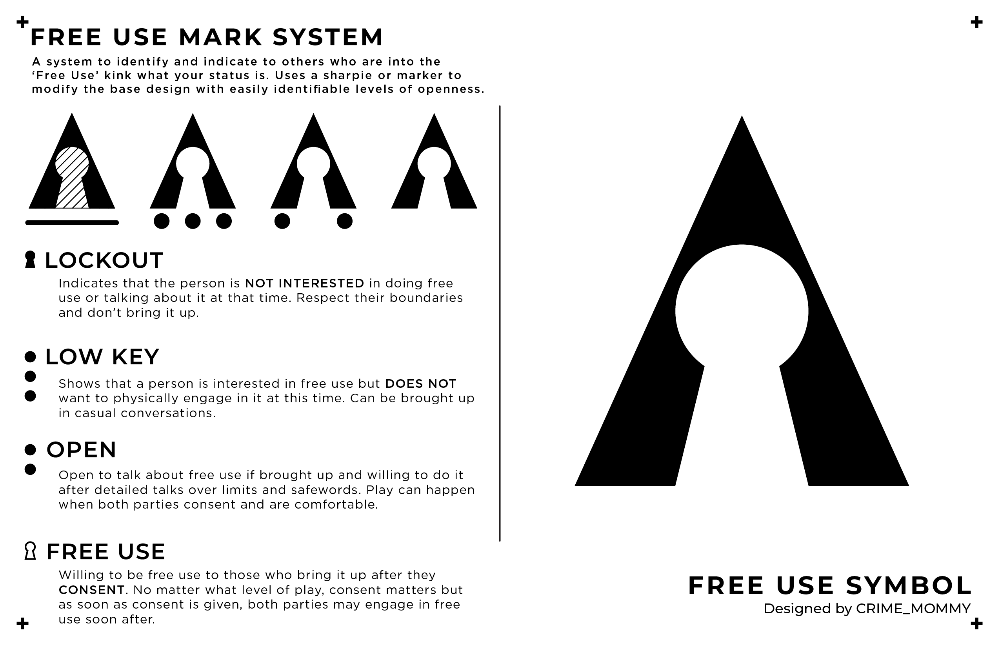

# The Free Use Mark System

> Symbols traced from CRIME_MOMMY's [creation](https://www.reddit.com/r/freeuse/comments/1cp7h95/preliminary_design_for_a_free_use_symbolsystem_id) on Reddit.

## Image Transcription

### Lockout 

**Symbol** Filled in or shaded keyhole with a horizontal line beneath the base symbol

**Meaning:** Indicates that the person is **NOT INTERESTED** in doing free use or talking about it at that time. Respect their boundaries and don't bring it up.

### Low Key

**Symbol:** Three small circles evenly spaced beneath the main symbol.

**Meaning:** Shows that a person is interested in free use but **DOES NOT** want to physically engage in it at this time. Can be brought up in casual conversation.

### Open

**Symbol:** One small circle beneath each "leg" of the main symbol.

**Meaning:** Open to talk about free use if brought up and willing to do it after detailed talks over limits and safewords. Play can happen when both parties consent and are comfortable.

### Free Use

**Symbol:** Just the main symbol (a triangle with a keyhole cutout)

**Meaning:** Willing to be free use to those who bring it up after they **CONSENT**. No matter what level of play, consent matters but as soon as consent is given, both parties may engage in free use soon after.

## Notes

* All credit for the original creation of these symbols belongs to [u/CRIME_MOMMY](https://reddit.com/u/CRIME_MOMMY).
* The colors are from the popular Dracula Theme ("on dark" from Dracula, "on light" from Alucard), view them [here](https://draculatheme.com/contribute#:~:text=to%20maintain%20it.-,Color%20Palette,Dracula,-Alucard).
